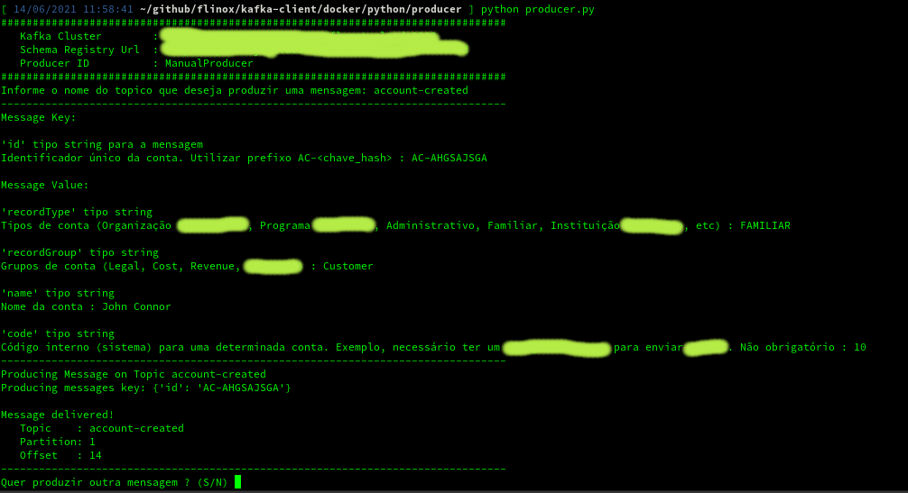
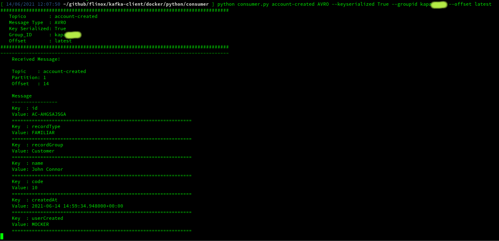

# kafka-client
Many tools to support your work with Kafka
suggestions, ideas or improvements please contact me!
[https://br.linkedin.com/in/flinox](https://br.linkedin.com/in/flinox)
if you like it or if it helped you in any way, please leave a STAR!

## Setting Environment
### Create a folder **_keys**
```
{root}/docker/_keys
```

### Create a file **consumer.properties** inside **_keys**
This file will be used for your shell consumer/producer.
```
ssl.endpoint.identification.algorithm=https
sasl.mechanism=PLAIN
request.timeout.ms=20000
retry.backoff.ms=500
bootstrap.servers=<kafka-host>:9092

sasl.jaas.config=org.apache.kafka.common.security.plain.PlainLoginModule required \
username="<ccloud-kc-api-key>" \
password="<ccloud-kc-api-secret>";
security.protocol=SASL_SSL

basic.auth.credentials.source=USER_INFO
schema.registry.basic.auth.user.info=<ccloud-sr-api-key>:<ccloud-sr-api-secret>
schema.registry.url=https://<schema-registry-url>
print.schema.ids=true
```


### Create a file **environment.properties** inside **_keys**
This file will be used for your python consumer/producer.
```
kafka-broker=<kafka-host>:9092
kafka-username=<ccloud-kc-api-key>
kafka-password=<ccloud-kc-api-secret>

schemaregistry-url=https://<schema-registry-url>
schemaregistry-username=<ccloud-sr-api-key>
schemaregistry-password=<ccloud-sr-api-secret>

# DEV
ccloud-environment=<ccloud-environment-key>
ccloud-cluster=<ccloud-cluster-key>
```

### Create a file **netrc** inside **_keys**
This file will be used for your ccloud and cli aplications, to automatically login ccloud.
```
machine confluent-cli:ccloud-username-password:login-<your-ccloud-account>-https://confluent.cloud
        login <your-ccloud-account>
        password <your-ccloud-password>
```


## Build the docker image
Build the container
```
docker build -t <your_dockerhub_acc>/<your_dockerhub_repo>:<version> .
```

Sample:
```
docker build -t flinox/kafka-client:latest .
```
or
```
./docker-build.sh
```

## Run the image
Run the container, mapping local folders
```
docker run --rm -it --hostname kafka-client --name kafka-client \
--mount type=bind,source="$(pwd)"/_keys,target=/app/_keys/ \
--mount type=bind,source="$(pwd)"/python,target=/app/python/ \
--mount type=bind,source="$(pwd)"/shell,target=/app/shell/ \
-p 8080:8080 \
flinox/kafka-client:latest \
/bin/bash

```
or
```
./docker-run.sh
```


## The Tools

### Python producer app
The program is ready to produce messages in avro topic, according to the topic you enter it will fetch the latest version of the schema from the schema registry and will ask you for each of the fields in the schema, so that you can produce a message manually but accordingly with the topic schema.

Sample:



### Python consumer app
The program is ready to consume messages of avro/json topic, returning inclusive the partition and offset.

Sample:



### Shell scripts (linux)
For more informations about the script run **script_name.sh** without any argument.

- Script to create a kafka connector using kafka-connect API REST
    > [connector_create.sh](connector_create.sh)
- Script to update a kafka connector using kafka-connect API REST
    > [connector_update.sh](connector_update.sh)
- Script to delete a kafka connector using kafka-connect API REST
    > [connector_delete.sh](connector_delete.sh)


- Script to consume messages in AVRO from kafka using kafka-console-consumer 
    > [consumer_avro.sh](connector_avro.sh)
- Script to consume messages from kafka using kafka-console-consumer 
    > [consumer.sh](consumer.sh)    


- Script to set the environment of confluent cloud
    > [environment_set.sh](environment_set.sh)

- Script to create schema(s) on confluent cloud schema registry of environment set, schemas must be in a [schemas](./schemas/) folder
    > [schema_create.sh](schema_create.sh)

- Script to delete schema(s) on confluent cloud schema registry of environment set
    > [schema_delete.sh](schema_delete.sh)

- Script to create topic(s) on confluent cloud kafka cluster of environment set, topics must be in a [topicos.txt](./topics/topicos.txt)
    > [topic_create.sh](topic_create.sh)    

- Script to delete topic(s) on confluent cloud kafka cluster of environment set
    > [topic_delete.sh](topic_delete.sh)      

- Script to recreate a topic and schema on confluent cloud kafka cluster / schema registry of environment set
    > [topic_schema_recreate.sh](topic_schema_recreate.sh)  

### Schema file sample
A key schema sample:
```
{
    "type": "record",
    "name": "account_created",
    "namespace": "br.com.flinox",
    "doc": "{\"description\":\"Este evento representa a criação de uma conta.\",\"topic\":\"account-created\",\"author_team\":\"Kapa\",\"author_name\":\"Kapa\",\"author_email\":\"kapacitordefluxo@flinox.com.br\",\"support_name\":\"Kapa\",\"support_phone\":\"---\",\"support_email\":\"kapacitordefluxo@flinox.com.br\",\"schema_context\":\"br.com.flinox\"}",
    "fields": [
      {
        "name": "id",
        "doc" : "Identificador único da conta. Utilizar prefixo AC-<chave_hash>",
        "type": "string"
      }
    ],
    "connect.name": "br.com.flinox.account_created"
  }
```
A value schema sample:

```
{
    "type": "record",
    "name": "account_created",
    "namespace": "br.com.flinox",
    "doc": "{\"description\":\"Este evento representa a criação de uma conta.\",\"topic\":\"account-created\",\"author_team\":\"Kapa\",\"author_name\":\"Kapa\",\"author_email\":\"kapacitordefluxo@flinox.com.br\",\"support_name\":\"Kapa\",\"support_phone\":\"---\",\"support_email\":\"kapacitordefluxo@flinox.com.br\",\"schema_context\":\"br.com.flinox\"}",
    "fields": [
      {
        "name": "id",
        "doc" : "Identificador único da conta. Utilizar prefixo AC-<chave_hash>",
        "type": "string"
      },
      {
        "name": "recordType",
        "doc" : "Tipos de conta (Organização Empresarial, Programa Acadêmico, Administrativo, Familiar, Instituição de Ensino, etc)",
        "type": "string"
      },
      {
        "name": "recordGroup",
        "doc" : "Grupos de conta (Legal, Cost, Revenue, Customer)",
        "type": [
          "null",
          "string"
        ],
        "default": null 
      },
      {
        "name": "name",
        "doc" : "Nome da conta",
        "type": [
          "null",
          "string"
        ],
        "default": null 
      },
      {
        "name": "code",
        "doc" : "Código interno (sistema) para uma determinada conta. Exemplo, necessário ter um código do JAC. Não obrigatório", 
        "type": [
          "null",
          "string"
        ],
        "default": null 
      },
      {
        "name": "createdAt",
        "doc" : "Unix epoch da data/hora de criação",
        "type": [
          {
            "type": "long",
            "connect.version": 1,
            "connect.name": "org.apache.kafka.connect.data.Timestamp",
            "logicalType": "timestamp-millis"
          }
        ]
      },
      {
        "name": "userCreated",
        "doc" : "Nome do usuário que criou a conta",
        "type": "string"
      }
    ],
    "connect.name": "br.com.flinox.account_created"
  }
```

### Topic file sample
```
account-created                10   3
account-updated                10   3
```
First argument is topic name
Second argument is partition(s)
Third argument is replica(s)


[https://br.linkedin.com/in/flinox](https://br.linkedin.com/in/flinox)